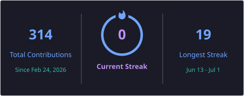

<h1 align="center">Hi 👋, I'm Nishant Yadav</h1>
<h3 align="center">Software Developer | Android Developer | Full Stack Developer</h3>

## 🚀 About Me

- 🎓 B.Tech CSE (Google Cloud Platform Specialization)
- 💻 Passionate about Software Development
- 📱 Android Developer using Kotlin & XML
- 🌐 Full Stack Developer using Node.js
- ☁️ Learning Cloud & DevOps
- 📫 Reach me: nishantyadav23082004@gmail.com

## 🛠 Tech Stack

## 📊 GitHub Stats

  
  

  

## 🤝 Connect With Me

  

  

  

⭐️ From [nishanty23](https://github.com/nishanty23)
